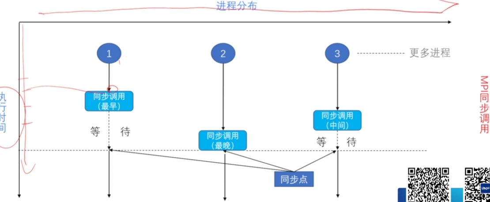
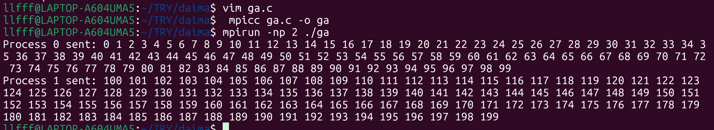
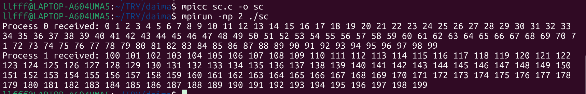

# MPI组通信概述 #
## 01组通信 ##
- 1对多，多对1，多对多
### 功能 ###
- 通信：数据的传播
- 同步：在执行进度在取得一致  
  
- 计算：给定数据完成一定的操作(`归约`)
    - 组内消息通信
    - 计算`(归约)`
    - 结果放入缓存区
## 02组通信-广播 ##
- MpI广播接口：`MPI_Bcast(buffer,count,datatype,root,comm)`
``` c
int rank,value;
MPi_Init(&argc,&argv);
MPI_Comm_rank(MPI_COMM_WORLD,&rank);
do{if(rank==0)
    scanf("%d",&value);
    MPI_Bcant(&value,1,MPI_INT,0,MPI_COMM_WORLD);
    printf("process %d got %d\n",rank,value);
}while(value>=0);
MPI_Finalize();
return;
```
## 02组通信-收集 ##
### 单进程收集  
-  MpI收集接口：`MPI_Gather(sendbuf,sendcount,sendtype,recvbuf,recvcount,recvtype,root,comm)`**多对1**
```c
#include <mpi.h>
#include <stdlib.h>
#include <stdio.h>

int main(int argc, char *argv[]) {
    MPI_Comm comm;
    int rank, gsize, sendarray[100];
    int root = 0, *rbuf = NULL;

    MPI_Init(&argc, &argv);
    MPI_Comm_dup(MPI_COMM_WORLD, &comm);
    MPI_Comm_rank(comm, &rank);  // 获取当前进程的 rank
    MPI_Comm_size(comm, &gsize);

    // 初始化 sendarray（每个进程填充不同的数据）
    for (int i = 0; i < 100; i++) {
        sendarray[i] = i + rank * 100;
    }

    // 只有根进程需要分配 rbuf
    if (rank == root) {
        rbuf = (int *)malloc(gsize * 100 * sizeof(int));
    }

    MPI_Gather(sendarray, 100, MPI_INT, rbuf, 100, MPI_INT, root, comm);

    // 只有根进程打印结果
    if (rank == root) {
        for (int i = 0; i < gsize; i++) {
            printf("Process %d sent: ", i);
            for (int j = 0; j < 100; j++) {
                printf("%d ", rbuf[i * 100 + j]);
            }
            printf("\n");
        }
    }

    if (rank == root) {
        free(rbuf);
    }
    MPI_Comm_free(&comm);
    MPI_Finalize();
    return 0;
}
```
  
-  MpI收集接口：`MPI_GatherV(sendbuf,sendcount,sendtype,recvbuf,recvcounts,displs,recvtype,root,comm)`

- **displs:数组(不同长度)**

## 02组通信-散发 ##
- MPI_Scatter (sendbuf,sendcount,sendtype,recvbuf,recvcount,recvtype,root,comm)
```c
#include <mpi.h>
#include <stdlib.h>
#include <stdio.h>

int main(int argc, char *argv[]) {
    MPI_Comm comm = MPI_COMM_WORLD;
    int rank, gsize;
    int *sendbuf = NULL;  // 根进程的发送缓冲区
    int rbuf[100];        // 所有进程的接收缓冲区
    const int root = 0;   // 显式声明根进程

    MPI_Init(&argc, &argv);
    MPI_Comm_rank(comm, &rank);
    MPI_Comm_size(comm, &gsize);

    // 只有根进程需要分配和初始化 sendbuf
    if (rank == root) {
        sendbuf = (int *)malloc(gsize * 100 * sizeof(int));
        for (int i = 0; i < gsize * 100; i++) {
            sendbuf[i] = i;  // 示例：填充连续整数
        }
    }

    // 分发数据（非根进程的 sendbuf 可传 NULL）
    MPI_Scatter(sendbuf, 100, MPI_INT, rbuf, 100, MPI_INT, root, comm);

    // 每个进程打印自己收到的数据
    printf("Process %d received: ", rank);
    for (int i = 0; i < 100; i++) {
        printf("%d ", rbuf[i]);
    }
    printf("\n");

    // 只有根进程需要释放 sendbuf
    if (rank == root) {
        free(sendbuf);
    }

    MPI_Finalize();
    return 0;
}
```


- MPI_SCATTERV(sendbuf,**sendcounts**,**displs**,sendtype,recvbuf,recvcount,recvtype,root,comm)

## 通信组——组收集 ##
- MPI_Allgather(sendbuf,sendcount,sendtype,recvbuf,recvcount,recvtype,root,comm)

- MPI_AllgatherV(sendbuf,sendcounts,displs,sendtype,recvbuf,recvcount,recvtype,root,comm)
